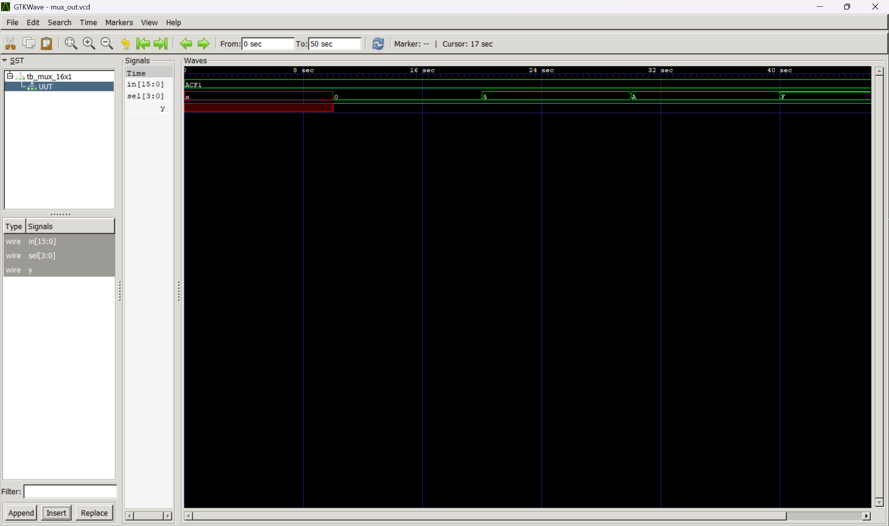

# 16×1 Multiplexer using Verilog HDL

## Overview

This repository contains the Verilog HDL implementation of a **16×1 Multiplexer (MUX)**. The design selects one of sixteen input signals based on the value of the four select lines and forwards the selected input to the output. The project demonstrates the implementation of combinational logic in Verilog HDL and verifies its functionality through simulation.

---

## Project Description

A **16×1 Multiplexer** is a combinational circuit that selects one of sixteen input signals and routes it to a single output. The selected input is determined by the 4-bit select signal (`S3:S0`). This design is implemented in Verilog HDL and verified using a testbench and GTKWave simulation.

---

## Features

- 16×1 Multiplexer implementation
- Verilog HDL design
- Combinational logic circuit
- Functional verification using a testbench
- GTKWave simulation output

---

## Inputs and Outputs

| Signal | Type | Description |
|--------|------|-------------|
| I0–I15 | Input | Sixteen data inputs |
| S3–S0 | Input | Four select lines |
| Y | Output | Selected output |

---

## Logic Function

The output **Y** is equal to the input selected by the 4-bit select signal.

| Select (S3 S2 S1 S0) | Output |
|:--------------------:|:------:|
| 0000 | I0 |
| 0001 | I1 |
| 0010 | I2 |
| 0011 | I3 |
| 0100 | I4 |
| 0101 | I5 |
| 0110 | I6 |
| 0111 | I7 |
| 1000 | I8 |
| 1001 | I9 |
| 1010 | I10 |
| 1011 | I11 |
| 1100 | I12 |
| 1101 | I13 |
| 1110 | I14 |
| 1111 | I15 |

---

## File Structure

```
16x1_MUX/
│
├── mux16x1.v
├── mux16x1_tb.v
├── waveform.png
└── README.md
```

---

## Simulation Output

> Replace the image below with your GTKWave simulation output.



---

## Tools Used

- Verilog HDL
- Icarus Verilog
- GTKWave
- GitHub

---

## How to Run

1. Compile the design and testbench using Icarus Verilog.
2. Run the simulation.
3. Generate the VCD file.
4. Open the VCD file using GTKWave.
5. Verify that the output matches the selected input for each value of the select lines.

---

## Learning Outcome

This project demonstrates:

- Design of a 16×1 Multiplexer using Verilog HDL
- Implementation of combinational logic
- Functional verification using a testbench
- Waveform analysis using GTKWave
- Understanding of multiplexer operation and select-line functionality

---

## Author

**Ansh Tyagi**

Integrated ECE (VLSI) Student  
Jaypee Institute of Information Technology (JIIT), Noida

---
